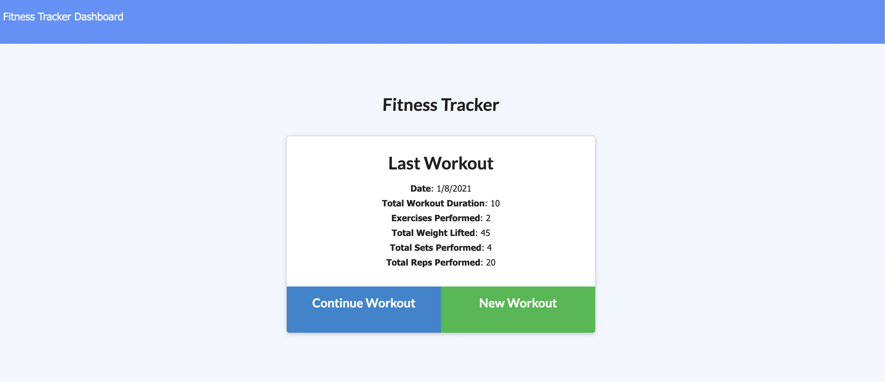
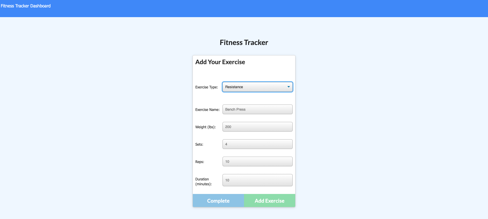
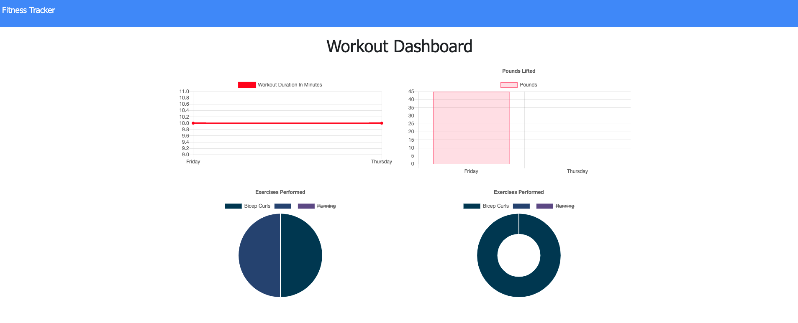

# Fitness Tracker

## Description

This is a web application that allows the user to track their exercises and view the combined totals (weight, duration) for the past week in line, bar and pie charts.

## Table of Contents

* [Link](#link)
* [Usage](#usage)
* [Credits](#credits)
* [Questions](#questions)
* [License](#license)

## Link

Herku deployed application:
https://enigmatic-anchorage-29726.herokuapp.com/

## Usage

When you navigate to the page, you will see the most recent workout logged, and be given the option to either continue with this workout, or create a new one.

On the exercise page, you can enter your workout information. There are two types of workouts: Resistance and Cardio, each with different fields to be filled out.

When you click complete, or navigate to the dashboard, you will see charts populated with information about your workouts total duration and total weight.

## Credits

First I must credit the UCLA Extension Full-Stack Web Development Coding Bootcamp, instructor Bryan Swarthout, and TA Wilson Lam for providing me with all of the tools and knowledge I used to build this application.

http://www.uclaextension.edu

The npm package "Express" was used to create the server.

https://expressjs.com/

Heroku was used to host the website for deployment.

https://www.heroku.com

The database was created using MongoDB.

https://www.mongodb.com/3

Robo 3T was used to work with the MongoDB database.

https://robomongo.org/

The npm package 'Mongoose' was used to interact with the MongoDB database.

https://mongoosejs.com/

The npm package 'Morgan' was used to view interactions with the MongoDB database in the terminal.

https://www.npmjs.com/package/morgan

Mongo Atlas was used to deploy the database.

https://www.mongodb.com/cloud/atlas#:~:text=MongoDB%20Atlas%20is%20the%20global,data%20security%20and%20privacy%20standards.

## Questions

For any questions, I, DJ Hersh, can be contacted via email at DanielJHersh@gmail.com

My GitHub profile is located at https://github.com/DJ620

## License

MIT License

Copyright (c) [2020] [DJ Hersh]

Permission is hereby granted, free of charge, to any person obtaining a copy
of this software and associated documentation files (the "Software"), to deal
in the Software without restriction, including without limitation the rights
to use, copy, modify, merge, publish, distribute, sublicense, and/or sell
copies of the Software, and to permit persons to whom the Software is
furnished to do so, subject to the following conditions:

The above copyright notice and this permission notice shall be included in all
copies or substantial portions of the Software.

THE SOFTWARE IS PROVIDED "AS IS", WITHOUT WARRANTY OF ANY KIND, EXPRESS OR
IMPLIED, INCLUDING BUT NOT LIMITED TO THE WARRANTIES OF MERCHANTABILITY,
FITNESS FOR A PARTICULAR PURPOSE AND NONINFRINGEMENT. IN NO EVENT SHALL THE
AUTHORS OR COPYRIGHT HOLDERS BE LIABLE FOR ANY CLAIM, DAMAGES OR OTHER
LIABILITY, WHETHER IN AN ACTION OF CONTRACT, TORT OR OTHERWISE, ARISING FROM,
OUT OF OR IN CONNECTION WITH THE SOFTWARE OR THE USE OR OTHER DEALINGS IN THE
SOFTWARE.